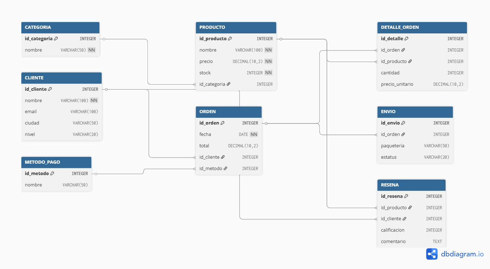

# Práctica 6: Caso Integrador - Sistema de E-Commerce

Este repositorio contiene la solución completa para el Caso Integrador de la Práctica 6 (Bases de Datos), implementando un sistema de gestión para una **Tienda de Electrónica en Línea**.

El proyecto ha sido desarrollado bajo la modalidad **"Opción B (Avanzada)"**, entregando un despliegue contenerizado con Docker que no requiere configuración de entorno local.

## Integrantes del Equipo
* **Hernandez Velazquez Luis Alberto** 
* **Maravilla Ipolito Cristopher Esteban** 
* **Grupo:** 3BV1

---

## Descripción del Dominio
El sistema modela el flujo de negocio de un E-Commerce, gestionando:
1.  **Inventario:** Productos clasificados por categorías con control de stock.
2.  **Ventas:** Procesamiento de órdenes de compra, detalles de productos y cálculo de totales.
3.  **Logística:** Gestión de envíos con diferentes paqueterías y estatus.
4.  **Usuarios:** Administración de clientes (VIP/Regular) y sus métodos de pago.
5.  **Feedback:** Sistema de reseñas y calificaciones de productos.

---

## Modelo de Datos (Diagrama EER)
El esquema relacional consta de **8 tablas** normalizadas.



---

## Instrucciones de Instalación y Ejecución
Este proyecto utiliza **Docker Compose** para orquestar la base de datos y la aplicación. No es necesario instalar .NET ni PostgreSQL en su máquina.

### Requisitos
* Docker Desktop (o Docker Engine) en ejecución.

### Pasos para el Despliegue
1. **Clonar el repositorio:**
   ```bash
   git clone https://github.com/LuisHV935/Practica-6---Base-De-Datos

